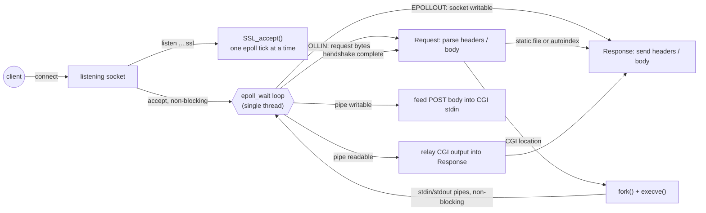
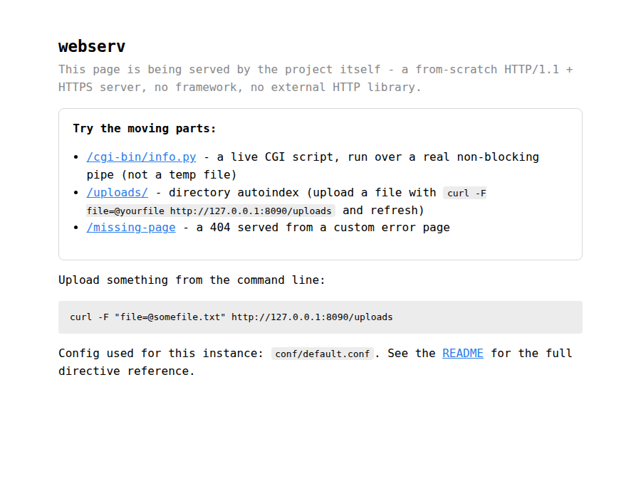
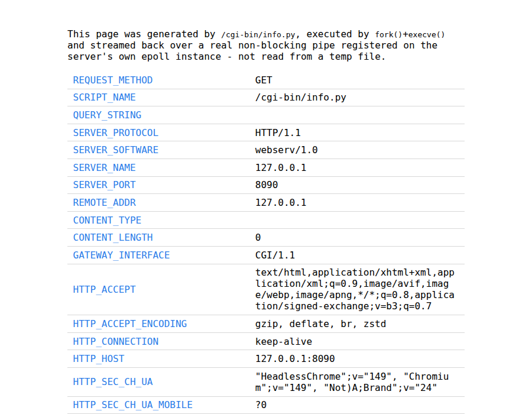
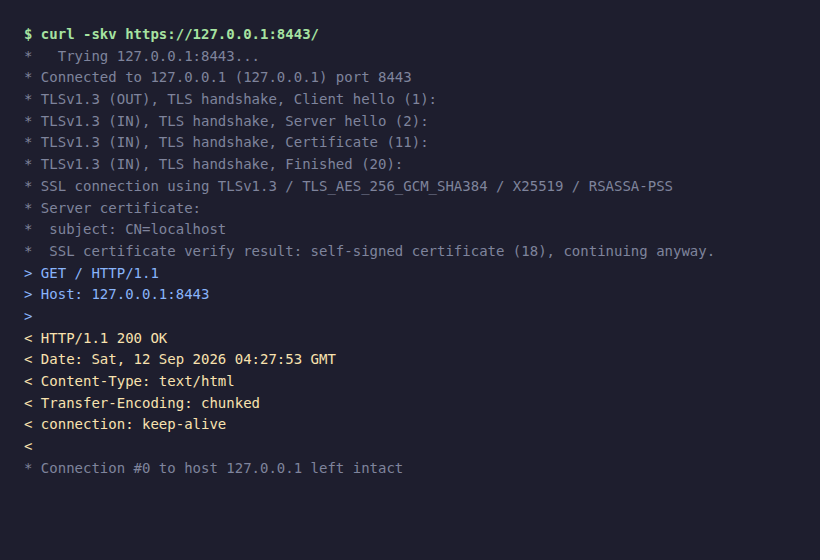

# webserv

*A from-scratch HTTP/1.1 and HTTPS server in C++20 - no framework, no external HTTP library, just epoll and POSIX sockets.*


Originally a 42 School project (C++98, a restricted function
whitelist, no external libraries). That project was retired from the
42 curriculum, which lifted those constraints - this is a
from-scratch modernization: C++20, RAII throughout,
`std::filesystem`, structured logging, real CGI pipes instead of temp
files, and OpenSSL-backed TLS.

## Quick start

Verified on Ubuntu 24.04, GCC 13, CMake 3.28, OpenSSL 3.0.

Needs a C++20 compiler, CMake 3.16+, and OpenSSL development headers
(`libssl-dev` on Debian/Ubuntu, `openssl-devel` on Fedora/RHEL).
`curl` and `python3` too if you also want to run the test suite.
[spdlog](https://github.com/gabime/spdlog) is fetched and built
automatically by CMake - nothing else to install.

```
git clone https://github.com/bahbibe/webserv.git
cd webserv
cmake -S . -B build
cmake --build build -j4   # raise this if you have RAM/cores to spare - bare -j (no number)
                          # means unbounded parallel compiles, which can push a modest
                          # machine into swap
./webserv
```

That starts the server on `http://127.0.0.1:8090`, using
`conf/default.conf` and the example site checked into `WWW/`:

```
curl http://127.0.0.1:8090/                                 # static page
curl http://127.0.0.1:8090/cgi-bin/info.py                  # live CGI output
curl -F "file=@somefile.txt" http://127.0.0.1:8090/uploads   # upload a file
curl http://127.0.0.1:8090/uploads/                          # see it listed
```

To serve your own site: `./webserv path/to/your.conf` - see "Config
file" below for the full directive reference.

```
cmake --build build -j4                                          # incremental rebuild
rm -rf build && cmake -S . -B build && cmake --build build -j4  # clean rebuild (rarely needed)
bash tests/run_tests.sh                                          # end-to-end test suite
./build/webserv_tests                                            # config parser unit tests
valgrind --leak-check=full ./webserv [config_file]                # manual leak check
```

Two separate test suites, on purpose: `tests/run_tests.sh` drives a
real running server over HTTP/curl and is authoritative for
*observable server behavior* - request handling, CGI, uploads,
keep-alive, shutdown. `webserv_tests` (`tests/unit/`, built via
CMake's `WEBSERV_BUILD_TESTS` option, on by default) is a `doctest`
suite scoped narrowly to the config parser (`Lexer` +
`ConfigParser`) - it exercises structural edge cases and directive
validation directly, without spinning up a socket. A parsing bug or
a new config directive gets a unit test here; a change to what the
server actually does with a request gets an end-to-end case in
`tests/run_tests.sh`.

For AddressSanitizer + UndefinedBehaviorSanitizer:

```
cmake -S . -B build-asan -DWEBSERV_SANITIZE=ON -DWEBSERV_BUILD_TESTS=OFF
cmake --build build-asan -j4
ASAN_OPTIONS=detect_leaks=1 build-asan/webserv [config_file]
```

CI (`.github/workflows/ci.yml`) runs the unit suite, the end-to-end
suite, the same suite again under ASan/UBSan, and `cppcheck` on every
push and PR. See [SECURITY.md](SECURITY.md) for the vulnerability
reporting policy.

## Architecture

Single process, single thread, one `epoll` instance. Every fd that
could block - client sockets, CGI stdin/stdout pipes, TLS handshakes -
is registered on it non-blocking; nothing here calls a blocking
`read()`, `write()`, `accept()`, or `SSL_accept()`.



## Notable engineering decisions

- **CGI runs over real non-blocking pipes, not temp files.**
  `pipe()` + `dup2()` + `fork()` + `execve()`, with the pipe fds
  registered on the *same* epoll instance as client sockets - a CGI
  response streams as it's produced instead of buffering to disk
  first. A crash before any output gets a clean 500; a crash after
  streaming has already started just truncates the response cleanly,
  matching how a real reverse proxy behaves.
- **POST keep-alive with exact body draining, `Content-Length` or
  chunked.** The easy, common shortcut is to just close every POST
  connection so an unread request body can never corrupt the next
  request. This tracks raw bytes consumed against a declared
  `Content-Length` instead, and if an error fires before the client
  finishes sending, drains exactly the declared remainder off the
  wire before reusing the connection. A `Transfer-Encoding: chunked`
  body has no declared length to count against, but its own framing
  marks the end just as unambiguously - the same chunk parser that
  handles a normal chunked upload switches into a discard mode and
  keeps walking chunk boundaries (including the terminating zero-size
  chunk and trailer part) to find where the client's body actually
  ends. Verified over a real socket, both ways: an oversized POST -
  `Content-Length` or chunked - gets a `413` with the connection kept
  alive, and the next request on that same TCP connection still
  parses cleanly.
- **TLS runs inside the same non-blocking reactor.**
  `SSL_accept()`/`SSL_read()`/`SSL_write()` advance one `epoll` tick
  at a time - no blocking handshake, no separate thread. TLS 1.2
  minimum, TLS 1.3 negotiated by default.
- **Config validation collects every error before starting
  anything.** A bad directive, a missing root path, a port already
  in use - the whole file is checked and every problem reported
  together, not just the first one hit.

Some numbers: ~3,900 lines of C++, one thread, 33 end-to-end test
checks (`tests/run_tests.sh`) plus 45 config-parser unit tests
(`webserv_tests`), zero warnings under
`-Wall -Wextra -Werror`, and a
`valgrind --leak-check=full --track-fds=yes` pass across the CGI/TLS/
upload/keep-alive matrix shows 0 leaked heap allocations and 0 leaked
file descriptors.

## Screenshots

| | |
|---|---|
|  The example site (`WWW/`), served over plain HTTP. |  `/cgi-bin/info.py` - a live CGI script showing its own meta-variables and request headers, run over `fork()`+`execve()` and a real pipe. |
|  `curl -v` against the same server over TLS - a real TLS 1.3 handshake, negotiated by the non-blocking `epoll`-driven `SSL_accept()`. | |

## Resources

Classic references consulted while building this project:

- RFC 9110 (HTTP Semantics), RFC 9111 (HTTP Caching), RFC 9112
  (HTTP/1.1) - the current HTTP specification set, used to check
  status code usage, header semantics, and connection/keep-alive
  behavior against the letter of the spec.
- RFC 3875 (The Common Gateway Interface, CGI/1.1) - CGI
  meta-variable set and request/response framing.
- RFC 8446 (TLS 1.3) and the [OpenSSL](https://www.openssl.org/docs/)
  API documentation - non-blocking `SSL_accept()`/`SSL_read()`/
  `SSL_write()` state handling.
- [nginx](https://nginx.org/en/docs/) documentation - the `server {}`
  / `location {}` config block style this project's config format is
  modeled on.

AI assistance (Claude Code) was used throughout this project's
hardening pass and the v2 modernization, under direct human direction
with every design decision explicitly reviewed and confirmed before
implementation: end-to-end code review against the HTTP RFCs above;
fixing bugs found that way (multipart parsing, path-traversal
validation, epoll busy-spin/timeout handling, memory leaks caught via
`valgrind`); implementing features (HEAD method, graceful shutdown,
access logging, HTTP/1.1 keep-alive, configurable CGI interpreter
paths, non-blocking sockets with partial-write handling); the v2
rewrite itself (CMake/C++20 migration, RAII cleanup, structured
logging, real non-blocking CGI pipes, TLS); and writing/extending the
end-to-end test suite (`tests/run_tests.sh`). Every change was built
warning-free (`-Wall -Wextra -Werror`), run through the test suite,
and manually verified against a real running server (`curl`,
`openssl s_client`, `valgrind`) before being committed.

## Access log

Every completed or aborted connection is appended (one line, flushed
immediately) to `access.log` next to the binary:

```
[2026-09-05 05:54:38] 127.0.0.1 GET / 200 11 0ms
[2026-09-05 05:54:38] 127.0.0.1 GET /missing.html 404 127 0ms
[2026-09-05 05:54:38] 127.0.0.1 HEAD / 200 0 0ms
[2026-09-05 05:54:51] 127.0.0.1 - - - 0 300ms
```

Fields: timestamp, client IP, method, path, status code, response
body size in bytes (headers and chunk framing excluded; always 0 for
`HEAD`), and total connection duration. A connection that closed
before a request could be parsed (e.g. an idle client that just
disconnects) logs `-` for method/path/status.

If the log file can't be opened (e.g. no write permission next to the
binary), the server prints a warning and keeps serving without
logging - it doesn't fail to start over this.

### Log rotation

`SIGHUP` closes and reopens `access.log` at the same path, without
restarting - the standard logrotate pattern: rotate (rename)
`access.log`, send `SIGHUP`, and the server picks up a fresh file
while whatever was renamed stays exactly as it was:

```
mv access.log access.log.1
kill -HUP $(pgrep webserv)
```

## Config file

The whole config file is validated before anything binds a socket:
every bad directive value, unknown directive, missing root path,
duplicate directive, and bind/listen failure (including a port
already in use) across the *entire* file is collected and reported
together, not just the first one hit - useful when writing a config
from scratch. If any errors are found, the server prints all of them
and exits without starting; nothing listens unless the whole file is
clean. A malformed `{`/`}` structure is the one thing that still
aborts immediately, since nothing past that point can be parsed
reliably.

When no config path is given on the command line, three tiers are
checked in order: an explicit `./webserv path/to/conf` always wins if
given; otherwise `/etc/webserv/webserv.conf`, if that directory
exists (a real system install - see "Production deployment" below);
otherwise `conf/default.conf` relative to the `webserv` binary's own
location (via `/proc/self/exe`), for running straight out of a git
checkout. `mime.types` and the access log follow whichever of those
tiers is actually in play. Paths *written inside* the config - `root`,
`upload_path`, `cgi_upload_path`, `ssl_certificate` - are not
tier-aware: they resolve relative to whatever directory `webserv` was
launched from, same as any other program reading a relative path. A
relative `root` needs to actually resolve to something real, which
for CGI locations in particular matters: the server `chdir()`s into a
CGI script's own directory before running it, so use an absolute path
(or launch from a fixed, known directory) if that's a concern.

Config files use an nginx-like block syntax:

```
server {
    host 127.0.0.1
    listen 8080
    server_name example.com

    root /path/to/site
    index index.html
    error_page 404 /path/to/404.html
    client_max_body_size 1000000
    autoindex off

    location /uploads {
        root /path/to/site/uploads
        allow GET POST DELETE
        upload on
        upload_path /path/to/site/uploads
        cgi on
        cgi_upload_path /path/to/site/uploads/cgi
        autoindex on
    }
}

server {
    host 127.0.0.1
    listen 8443 ssl
    ssl_certificate /path/to/cert.pem
    ssl_certificate_key /path/to/key.pem

    root /path/to/site
    index index.html
}
```

Multiple `server` blocks are supported (virtual hosting by
`server_name` on a shared `host:port`, and independent listeners on
different ports - plaintext and TLS listeners can coexist on
different ports in the same config).

### Main-context directives

Written outside any `server { ... }` block - before, between, or
after them, anywhere at the top level:

| Directive | Meaning |
|---|---|
| `pid <path>` | Write the process PID there on start, remove it on clean shutdown. Optional - not needed under systemd `Type=simple` (see "Production deployment"), useful for anything else that expects a pidfile. |
| `error_log <path> [level]` | Redirect diagnostics from the default stdout sink to a file, at the given level (`trace`/`debug`/`info`/`warn`/`error`/`critical`/`off`, default `info`). Replaces the default sink rather than adding a second destination, matching nginx's own `error_log` semantics. |
| `user <name> [group]` | Drop root privileges to this account (and group, if given - otherwise the account's primary group) right after every privileged startup step (socket binds, TLS cert loads, pidfile write, log open) and before any request bytes are parsed. No-op if the process isn't already root when this is set. See "Production deployment" below. |

An unrecognized directive at this level (or anywhere else in the
file) is a config error, same as inside a `server` block - nothing
here is silently ignored.

### Server-level directives

| Directive | Meaning |
|---|---|
| `host` | IPv4 or IPv6 address to bind (`localhost` is normalized to `127.0.0.1`); an IPv6 `host` binds IPv6-only (no dual-stack), so listen on both families with two `server` blocks on the same port |
| `listen <port> [ssl]` | Port to bind (defaults to 80 if empty); the `ssl` keyword makes this a TLS listener - requires `ssl_certificate` and `ssl_certificate_key` |
| `ssl_certificate` | Path to a PEM certificate file (required if `listen ... ssl`) |
| `ssl_certificate_key` | Path to the matching PEM private key (required if `listen ... ssl`) |
| `server_name` | One or more virtual host names |
| `root` | Filesystem root for this server; must exist |
| `index` | Default file(s) served for a directory request |
| `error_page <code> <path>` | Custom page for a status code (repeatable) |
| `client_max_body_size` | Max request body size in bytes (0 = unlimited) |
| `autoindex` | `on`/`off`, directory listing when no index file is found |
| `location <path> { ... }` | Per-path overrides, see below |

### Location-level directives

`root`, `index`, `autoindex`, `client_max_body_size` override the
server-level value for requests under that path. Additional
directives:

| Directive | Meaning |
|---|---|
| `allow` | Space-separated list of allowed methods (`GET`, `POST`, `DELETE`) |
| `upload on\|off` | Allow file uploads for `POST` requests |
| `upload_path` | Where uploaded files are written |
| `cgi on\|off` | Enable CGI execution (`.php` via `/usr/bin/php-cgi`, `.py` via `/usr/bin/python3` by default - see `cgi_path`) |
| `cgi_upload_path` | Where CGI-received request bodies are staged |
| `cgi_path <ext> <interpreter>` | Override the interpreter for an extension, e.g. `cgi_path py /usr/local/bin/python3.12`. Repeatable, one line per extension. |
| `return <url>` | Issue a 301 redirect to `<url>` |

## Production deployment

`scripts/install.sh` (needs root) lays out a real system install and
a systemd service:

```
sudo ./scripts/install.sh
sudo systemctl start webserv
sudo systemctl enable webserv    # start on boot
sudo systemctl status webserv
journalctl -u webserv -f
```

| Path | What |
|---|---|
| `/usr/local/sbin/webserv` | The binary |
| `/etc/webserv/webserv.conf` | Config (see "Config file" above) - a starting-point template, edit it in place |
| `/etc/webserv/mime.types` | MIME type table |
| `/var/www/webserv/` | Document root, populated from this repo's `WWW/` example site on first install |
| `/var/log/webserv/` | `access.log` and (if `error_log` is set, as the installed template does) `error.log` |
| `/etc/systemd/system/webserv.service` | `Type=simple` - systemd tracks the process directly, no daemonizing needed |

The unit also sandboxes the process at the systemd level -
`ProtectSystem=strict`, `ProtectHome`, `PrivateTmp`, a trimmed
`CapabilityBoundingSet` (just `CAP_NET_BIND_SERVICE` +
`CAP_SETUID`/`CAP_SETGID`/`CAP_DAC_OVERRIDE` for the root window
before the privilege drop below), and `ReadWritePaths` scoped to the
pidfile, logs, and uploads dir - on top of, not instead of, the
in-process privilege drop.

Re-running `install.sh` (an upgrade) never overwrites an
already-installed config or site - only a first install populates
those, so edits made after install are safe across upgrades.
`scripts/uninstall.sh` removes the binary and the systemd unit,
prompts before touching `/etc/webserv` or `/var/log/webserv`, and
leaves `/var/www/webserv` untouched entirely.

**Runs as an unprivileged user.** `install.sh` creates a dedicated
`webserv` system account (`useradd --system --no-create-home
--shell /usr/sbin/nologin`) and the installed config ships `user
webserv webserv` by default - the process binds `listen 80`/`443` as
root, then drops to `webserv:webserv` (real, effective, *and* saved
uid/gid, verified via a container test that reads the running
process's own `/proc/<pid>/status`) before parsing a single byte of
request data. CGI scripts inherit the drop for free, since `fork()`
only ever happens after it. Ownership on disk is scoped, not blanket:
only `/var/log/webserv/` and `/var/www/webserv/uploads/` are chowned
to `webserv:webserv` (what the running process actually needs to
write at runtime); the config, the binary, and the served site
content stay root-owned and read-only to it. `uninstall.sh`
intentionally leaves the `webserv` account in place - a leftover
no-login, no-home system account is inert, not a cleanup obligation.

`ExecReload=` sends `SIGHUP`, which today only reopens `access.log`
(see "Log rotation" above) - a full config reload without restarting
is tracked as future work, see below.

## Docker

A multi-stage `Dockerfile` builds the binary in a `debian-slim` image
with the full toolchain, then ships only what's needed to run it - no
compiler, no build tools - in a second `debian-slim` runtime stage
(~154MB). The image bakes in the example site (`WWW/`) and a
container-aware config (`conf/webserv.conf.docker` - binds `0.0.0.0`
instead of `127.0.0.1`, since a container's own loopback isn't what
Docker's port mapping reaches), so it runs with zero required flags:

```
docker build -t webserv .
docker run -p 8090:8090 webserv
```

Published on Docker Hub as
[`bahbibe/webserv`](https://hub.docker.com/r/bahbibe/webserv) - no
build step needed:

```
docker run -p 8090:8090 bahbibe/webserv
```

Runs as a dedicated unprivileged user inside the container (the
container itself is the isolation boundary here - this image never
binds a privileged port, so there's no root-then-drop dance the way
`install.sh`'s systemd deployment has).

To serve your own site or use your own config instead of what's
baked in:

```
docker run -p 8090:8090 -v ./mysite:/app/WWW webserv
docker run -p 8090:8090 -v ./myconf.conf:/app/conf/webserv.conf.docker webserv
```

A mounted site replaces the whole `WWW/` tree, not just
`index.html` - the baked-in config's `location` blocks expect
`WWW/uploads`, `WWW/cgi-bin`, and `WWW/err/*.html` to exist, so an
incomplete custom site fails config validation at startup unless it
includes those directories or comes with its own config that only
declares the locations it actually needs.

## Supported HTTP behavior

- Methods: `GET`, `HEAD`, `POST`, `DELETE`. `HEAD` behaves exactly like
  `GET` (same status, same headers) but never sends a body; it's
  permitted anywhere `GET` is, so `allow` directives don't need to
  list it separately.
- HTTP/1.1 only (`505` on any other version).
- TLS 1.2 minimum (TLS 1.3 negotiated where the client supports it),
  OpenSSL-backed, fully non-blocking through the same `epoll` loop as
  everything else - not a blocking `SSL_accept()`/`SSL_read()`/
  `SSL_write()` anywhere.
- Keep-alive: responses reuse the connection for the next request
  unless the client sends `Connection: close` (no pipelining - the
  client must read each response before sending the next request).
  `POST` is keep-alive eligible whether its body length was declared
  up front (`Content-Length`/`multipart/form-data`) or framed as
  `Transfer-Encoding: chunked` - both mark their own end unambiguously
  (a byte count for the former, the terminating zero-size chunk plus
  trailer part for the latter), so if an error fires before the
  client finishes sending, the rest of the body is read and discarded
  - by byte count or by walking the remaining chunk framing,
  whichever applies - before the connection is reused, so no leftover
  bytes get parsed as the start of the next request.
- Request bodies via `Content-Length`, `Transfer-Encoding: chunked`,
  or `multipart/form-data`.
- Every response carries a `Date` header (RFC 9110 6.6.1).
- Status codes returned: 200, 201, 204, 301, 400, 403, 404, 405, 408,
  409, 411, 413, 414, 500, 501, 504, 505.
- Idle connections are dropped with a `408` after 10 seconds without a
  complete request, or after 30 seconds total regardless of activity
  (a client trickling bytes just often enough to keep resetting the
  idle timer still gets cut off).
- The header block (request line + headers, before the body) is
  capped at 8192 bytes; over that is a `400` and the connection is
  closed.
- Up to 512 concurrent connections; beyond that, new connections are
  accepted and immediately closed rather than queued.
- Directory requests without a trailing slash are redirected (301);
  directory requests are served from `index`, or an autoindex listing
  if `autoindex on` and no index file is found.
- `DELETE` removes files and, recursively, directories.
- Path traversal outside a location's configured root is rejected
  with `403`.
- CGI stdin/stdout run over real non-blocking pipes registered on the
  same `epoll` instance - no filesystem round-trip. A CGI process that
  doesn't respond within 5 seconds is killed; if that happens before
  any output was sent, the client gets a clean `504`, otherwise the
  partial response is closed cleanly (matches real reverse-proxy
  behavior - once a 200 stream has started, a crash truncates it
  rather than retroactively becoming an error page).
- `SIGINT`/`SIGTERM` (e.g. Ctrl-C) trigger a graceful shutdown: the
  server stops accepting new connections immediately, finishes any
  requests already in flight (up to a 5 second grace period, after
  which remaining connections are force-closed), then exits.
- Sockets (listening and client) are non-blocking; all I/O is driven
  through a single shared `epoll` instance, and partial/would-block
  writes are resumed on the next writable tick rather than dropped.
- A thrown exception while servicing one connection (e.g. an
  allocation failure under memory pressure) closes just that
  connection - it doesn't take the whole server down.

## Known limitations

- Single-process, single-threaded reactor (the same model one nginx
  worker process uses): CGI forks a child process, but the event loop
  itself doesn't use additional threads. I/O-bound workloads (sockets,
  disk, CGI exec) don't benefit much from in-process threading without
  also reworking file I/O to be async, and multiple worker
  *processes* (nginx's actual scaling model) would be a separate,
  larger change.
- No HTTP pipelining: a client must read each response before sending
  the next request on the same connection (see "Keep-alive" above).
- No SNI / multiple TLS certificates on one listener - one certificate
  per `server` block, matched by which listening socket accepted the
  connection, not by the TLS ClientHello's server name.

## Out of scope (by design)

Considered and deliberately not implemented, rather than gaps waiting
to be filled:

- **HTTP/1.0.** No persistent connections by default (the inverse of
  1.1, which this server already implements correctly with
  keep-alive), so supporting it would mean a second, parallel
  connection-handling code path for a strictly older protocol
  version - real added complexity for zero behavior this server
  doesn't already cover better under 1.1.
- **HTTP/2 (or HTTP/3/QUIC).** Not a support flag on top of the
  current server - a different wire protocol entirely (binary
  framing, stream multiplexing, header compression, and for HTTP/3 a
  UDP-based transport instead of TCP). Out of scope for a
  learning-focused HTTP/1.1 server.

## Possible future work

- A full config reload on `SIGHUP` (re-parse the file, rebuild live
  servers/locations/sockets without dropping connections) instead of
  requiring a restart - `SIGHUP` currently only reopens the access log
  (see "Log rotation" above), which was deliberately scoped smaller.
- SNI-based certificate selection for multiple TLS virtual hosts on
  one listener.
- Multi-worker-process scaling (nginx's actual model) if throughput
  ever becomes the bottleneck - a scaling change, not a correctness
  one, and not part of this project's current scope.
